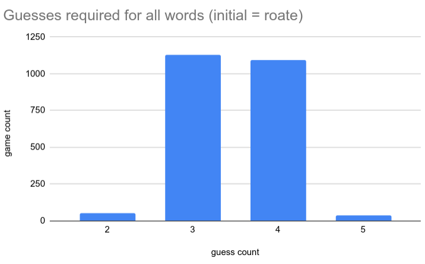

# wordle solver

Solves word puzzle interactively for [daily wordle](https://www.powerlanguage.co.uk/wordle/).

Never requires more than five guesses.  A performance analysis is pictured in the chart below:

There are 2315 words in the [challenge word list](possible.txt).  The above chart displays a histogram
of guess counts for each.

The full word list that is considered for valid guesses is [here](all_words.txt)

## Getting Started

Run the program: `python3 main.py`
No dependencies beyond the python3 standard library are required.

A prompt will appear.  Answer 'y' to do a self-test that iterates through all possible challenge words 
and measures guess counts for each.

Answer 'n' or hit enter to proceed to interactive guess mode.  The program will give you a guess and you
must enter the resulting color sequence of black (grey), orange and green using a sequence of five 
characters as instructed.

### Prerequisites

* `python3`
* `pytest` (only to run tests)

## Running the tests

`pip install pytest`

`pytest tests.py`

## Authors

* [Brad MacPhee](https://github.com/bmacphee/)

## License

This project is licensed under the MIT License - see the [LICENSE.md](LICENSE.md) file for details
